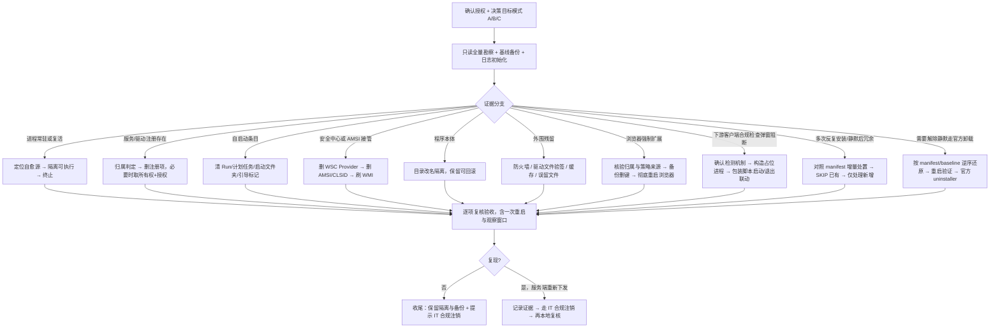

# YunMai disable —— 静默与禁用方法论（v0.6.2）

目标导向、可复用的完整流程：对“企业下发的 SASE/EDR/安全客户端”在本机实现静默、禁自启、停驻留、解除安全接管，并安全清理残留；同时明确本地隔离与合规注销的边界。全程不硬编码具体路径与名称，以方向性与流程性指导为准，兼容各种可能状态与系统版本差异。

## 0. 前置授权与目标验收（量化）
**硬性前提**：禁用企业安全软件属敏感操作，未经用户/IT 授权不得执行实际处置；未获授权时仅输出勘察报告与处置建议。企业环境处置前向直属 IT/安全团队报备并保留记录（工单/邮件等），收到停止指令立即停止；口头授权须补书面留痕（邮件确认/工单登记）后方可执行实际处置。
确认授权后，达成且仅达成以下可测量状态：
1. 相关进程数 = 0；正常重启一次后，在 ≥30 分钟观察窗口内仍为 0。
2. 相关服务/驱动注册项 = 0；系统服务查询返回“不存在/未安装”。
3. 自启动链路 = 0：登录 Run/RunOnce（含 32 位视图与当前用户）、启动文件夹、计划任务、StartupApproved、引导相关标记均无相关条目；浏览器无强制安装扩展策略残留。
4. Windows 安全中心不再显示该产品：其安全中心 Provider 各分类无条目，WMI 安全中心数据源无实例，界面不再出现 Open app。
5. AMSI 无其 Provider/CLSID 注册；被接管前的默认杀软（Defender 等）恢复启用与实时保护。
6. 程序本体已隔离（改名保留、可回滚）；主目录与用户缓存不再具备自启/驻留能力。
7. 防火墙无其规则；系统其他第三方安全产品、厂商驱动、用户既有配置（代理/网络/VPN）经基线比对未被改动；**共存的生产/办公客户端（勿动清单，含 SDP 接入客户端、VPDN 拨号器等）其目录、服务注册与运行状态与基线完全一致**。
8. 全程可回滚：注册表备份、隔离目录、处置前清单快照、操作日志均保留；**默认不删除隔离目录**。

## 1. 第一性原则与约束（奥卡姆剃刀）
- 问题本质 = 切断「可执行、可注册、可自启、可接管安全组件」四条链路；其余皆是手段。
- 先勘察后动手，只处理有证据的残留，不按猜测批量删除。
- 最小必要操作：能改名隔离就不删除；能删注册就不动文件；能验证归属才删驱动文件。
- **顺序铁律**：先清自愈源 → 隔离可执行文件 → 最后终止进程；顺序反了会被自愈逻辑拉起。
- 不误伤原则：不杀无关系统进程；不热重启受保护系统服务；不删其他安全产品的注册与驱动；不改用户代理/网络/VPN 等既有配置。
- **处置对象边界确认（勿动清单）**：处置范围仅限用户明确授权的目标产品。勘察中发现的**同机共存的生产/办公类客户端**（典型：SDP/零信任接入客户端如"研发云SDP"（SecAccess 目录、SdpClient/SdpUpdate 服务、sdp_client_windows.exe/client_web.exe）、VPDN 拨号器、OA/邮件/云桌面客户端）一律列入"勿动清单"，只记录、不处置——即使它们与目标产品同厂商、同生态、看似"企业下发的安全组件"。判断依据不是"它是什么类型"，而是"用户是否还在用它工作"。拿不准的一律不处置，先问用户。
- 破坏性操作前先留退路：注册表分支导出备份、目录改名而非直删。
- 基线可操作化：勘察时记录服务/驱动注册、自启动链路、安全中心与 AMSI、防火墙、计划任务、文件与目录清单的快照；处置后逐项比对，未变动项即零误伤证据。

## 2. 总体流程（从粗到细的多叉树）
```
0 决策：确认授权，确定目标模式
   A 仅停自启/静默   B 本地隔离禁用   C 配合 IT 合规解绑（服务端注销）
1 勘察（只读、全量）：进程与父子链 / 服务驱动注册 / 自启动点 / 安全中心与 AMSI /
   WMI 事件订阅 / 文件与目录 / 防火墙 / 计划任务 / 引导标记 / 登录会话与启动应用设置 /
   浏览器策略与强制扩展 / 用户配置基线（先记录，后处理）；勘察工具类别见 §2.1，全程只读不修改。
2 按“证据分支”处理（各分支独立，可并行，见 §3）
3 复核：对照 §0 验收清单逐项验证（含一次重启 + 观察窗口）
4 收尾：保留隔离目录与备份、记录日志、提示合规渠道
5 复现判定：若隔离后仍被重新下发，记录证据并转 IT 注销流程

### 2.1 勘察工具类别（方向性，不硬编码路径/命令）
- 服务与驱动：系统服务管理控制台 / 服务命令行查询（含子命令枚举）。
- 注册表：注册表编辑器，按子树定向枚举（含 32/64 位视图）。
- 计划任务：任务计划程序 / 命令行查询。
- 启动项：Autoruns 类启动项枚举工具（Run、服务、计划任务、启动文件夹等聚合视图）。
- 进程与钩子：任务管理器进程树 / 进程监视器类工具（含已加载模块、句柄、全局钩子 DLL 查看）。
- WMI 与安全中心：WMI/CIM 查询命令行工具（事件订阅、安全中心数据源、实例枚举）。
- 事件日志：事件查看器按来源过滤（服务拉起、重启、安装/修复记录）。
- 引导配置：BCD 查询工具（安全模式残留标记、BootExecute、启动项）。
- 浏览器：内置策略查看页与扩展页只读核对；读用户配置目录中的扩展清单文件确认名称/权限/来源。
```

## 3. 分项方法论（方向性步骤）
以“该客户端”代称，不涉及具体路径与名称。

### A. 驻留进程与自愈
目的：进程归零且不复活。
1. 自愈源检查点（逐项定位，有证据再处理）：服务 Recovery/失败后重启配置；守护或伴随进程及其父子链；计划任务；登录自启点；**WMI 事件订阅**（事件筛选器/事件消费者/绑定，可静默触发拉起或下发作恶）；客户端自身日志中“安装/自修复服务”等字样；事件日志中的重启/拉起证据。
2. 顺序铁律：清自愈源 → 隔离可执行文件（改名）→ 终止进程。
3. 验证：重启一次 + ≥30 分钟观察窗口内进程数保持 0。
4. WMI 事件订阅处置序列（若存在订阅）：先删绑定、再删消费者、最后删筛选器（按依赖序），逐条记录归属证据；删除失败或被占用时先记录错误再重试，必要时重启后复核，不强行重试；权限不足时以管理员会话执行，必要时调整对应 WMI 命名空间/对象的安全描述符（记录原值、处置后复原）或取所有权后再删。

### B. 服务与驱动注册
目的：注册项归零。
1. 归属判定（量化阈值）：以服务名、显示名、镜像路径三信号确认，至少两项一致方可处置；多安全产品共存时叠加签名厂商、发布者、安装时间、服务依赖等证据。信号冲突时以“可执行文件路径 + 签名发布者”为最高权重；仍无法裁决则不处置、记录并上报。
2. 备份 → 删除注册项 → 以系统服务查询确认“不存在”。
3. 受保护键/ACL 拒绝时：先启用对应特权，再“取所有权并授予本机管理员完全控制”后删除；多步提权用脚本文件承载，脚本以 UTF-8 带 BOM 保存避免中文乱码；内联启用特权易踩结构体封送坑，优先使用 .NET 注册表 API。
4. 驱动文件：删除前核对数字签名厂商，只删归属明确的。
5. 注册已删但服务查询仍显示“已停止”（删除挂起）：多为 SCM 缓存或服务镜像仍被进程/已加载 DLL 占用；先隔离可执行文件并结束占用进程，必要时重启后复核，确认注册不再出现。

### C. 自启动链路
目的：登录与开机无自启。
1. 清除点：Run/RunOnce（含 32 位视图与当前用户）、启动文件夹、计划任务、StartupApproved。
2. 无扩展名/异常扩展名文件：不按名称猜测，比对内容与主程序哈希、数字签名、创建时间与安装时间关联确认归属后再处置；登录时此类文件会被“默认打开”而非执行。
3. 引导相关标记：明确区分并检查安全模式残留标记、BootExecute、BCD 启动项，有则清除。
4. 验证：注销/重启后无相关进程。
5. 自处置自动化部署形态：启动目录只作为系统入口，不作为脚本安装、备份或文档存放位置；禁止把同一自动化同时放 `.cmd` 与 `.ps1`，因为 PowerShell 脚本在启动目录会被默认文件关联当文本打开。
6. 需要管理员权限的自动处置不用普通权限启动入口执行；应保留唯一受控脚本，创建登录触发、最高权限、隐藏执行、忽略重复实例且有限时的计划任务；替换启动入口前先备份。
7. 自处置脚本默认无可见窗口；成功状态由结构化日志与复核证明，UI 提示仅保留在异常路径（失败弹窗），并返回非零退出码。
8. 部署后手动触发一次：确认启动目录无重复入口、任务已注册且最高权限运行、日志无错误、目标状态已达成。

### D. 安全中心与 AMSI 接管
目的：恢复系统默认安全组件接管。
1. 检查点与操作序列：安全中心 Provider 各分类（防病毒/反间谍/防火墙等）逐一枚举，先记录每个 Provider 的名称与归属再处置；对目标条目按 启用特权 → 取所有权 → 授予本机管理员完全控制 → 删除 → 刷新安全中心服务或重启 的序列操作，任一步失败先记录再重试。
2. AMSI：删除其 Provider 注册与对应 CLSID。
3. WMI：安全中心数据源中的旧实例属缓存；先尝试删除实例，失败则依赖服务刷新或正常重启。
4. 恢复验证：默认杀软防病毒启用、实时保护开启；界面仅剩系统默认与用户既有第三方产品。
5. 版本/视图差异：同时检查 32/64 位注册表视图（重定向）；不同系统版本安全中心数据结构可能不同，以实际枚举为准。
6. Win11 差异：安全中心界面数据由安全中心服务聚合，Provider 键修改后需刷新该服务或重启才生效；“启动应用”设置与 StartupApproved 联动；企业设备（如 Entra 加入）可能改变下发通道与凭据模型；驱动加载签名要求更严，残留驱动更可能触发拒绝或系统保护。
7. 多产品共存验收：若默认接管者本身是另一第三方产品，验收目标不是恢复 Defender，而是以处置前基线为准—该产品不再出现在任何分类 Provider 中、其余产品与基线一致。

### E. 程序本体隔离
目的：残留触发点存在也无法执行。
0. **隔离前双重确认（防误清铁律）**：改名/清空任何目录前，逐项确认——(a) 该目录归属目标产品（按 §3.B 归属判定三信号：服务名/显示名/镜像路径，必要时叠加签名厂商）；(b) 该目录不是"勿动清单"中的共存生产客户端；(c) 引用该目录的 Windows 服务/计划任务/快捷方式已同步处置或明确属于目标产品。**绝对禁止**把仍被有效服务引用的第三方客户端目录改名/清空：服务 binPath 悬空 + 被置 Disabled 后，其客户端会报"无法连接服务器（超时）"等网络假象，真实原因是本地后端服务被破坏（实测案例：研发云SDP 目录被改名清空后客户端完全瘫痪，表面疑似代理冲突）。拿不准归属时宁可不隔离。
1. 安装目录与公共/用户数据目录、用户缓存目录全部改名隔离（保留可回滚），默认不删除。
2. 可选加固（仅在 IT 指导下）：对隔离目录设置 ACL—移除继承、仅保留系统与管理账户最小权限或直接拒绝写入/执行，防止服务端通道直接重写；先取所有权再改 ACL，改前记录原 ACL 便于回滚。注意 ACL 无法阻止以系统最高权限重新创建/下发的场景，最终仍需 IT 解绑。
3. 明确“隔离 ≠ 注销”：隔离只影响本机；服务端仍可能视设备在线并重新下发。

### F. 外围残留
目的：清理有据可查的附属物。
1. 防火墙规则（按显示名匹配该产品）删除。
2. 系统驱动目录遗留驱动文件：验签厂商后只删归属该产品的，保留系统与其他厂商文件。
3. 用户临时目录缓存、启动文件夹误留备份文件、失效“最近打开”快捷方式。
4. 复核计划任务与全部启动点。

### G. 复核与收尾
1. 对照 §0 逐项复核，含一次正常重启与观察窗口。
2. 验收方法（方向性）：系统服务查询返回“未安装”；进程列表归零；安全中心界面与对应数据源无条目；默认杀软实时保护开启。
3. 保留回滚物：隔离目录 + 注册表备份 + 处置前快照 + 操作日志；**默认不删除隔离目录**，是否删除交由用户决定。回滚验证：以备份还原后对照 §0 复核系统恢复正常、其他产品与基线一致，方可确认回滚有效；还原失败或部分还原时记录失败项，退回隔离态（保持可回滚）继续排查，必要时以系统快照/还原点重建后再次对照验收清单。
4. 操作日志字段规范：时间戳、操作对象、操作类型、操作前状态、操作后状态、执行人/会话；留存于本地日志文件并随工单上报，保留至合规审计结束。
5. 提示合规渠道：本地静默仅本机有效；账号/设备绑定需企业 IT 在管理平台解绑注销，否则可能被重新下发且无合规记录。交接时提交证据清单（服务/端口/时间线/日志/隔离物与备份清单），以服务端管理平台显示解绑/注销完成为确认标准；解绑后仍复现则再次复核本地残留与下发通道。
6. 复现判定：隔离后仍被重新下发时，记录证据（端口/服务/日志/时间线），判定为服务端管理通道所致，转 IT 注销流程；这不算本地处置失败。

### H. 浏览器扩展强制安装
目的：解除“由组织管理/无法手动关闭”的强制扩展。
1. 直接原因定位：Chromium 系浏览器策略注册表中的扩展强制安装清单（同时查 64/32 位视图，32 位视图多为反射）；Firefox 类浏览器查其策略文件机制。
2. 归属与根因判定：按清单中的扩展 ID 读用户配置目录下的扩展清单文件，确认名称/权限/来源商店；查原生消息宿主注册判断是否有本机同伴程序；区分策略来源（直写注册表 / 本地 GPO / 域 GPO）以预判是否会被周期回写；确认下发方是否仍在本机驻留（服务/进程/计划任务）。
3. 处置：备份导出策略键后，以管理员权限删除对应清单键/值（仅删归属该产品的条目）。
4. 生效与验证：彻底退出浏览器（含后台驻留与启动加速进程）再重启；复核策略键不存在、扩展目录被浏览器自动清理、扩展条目塌缩为卸载墓碑。
5. 防误伤：不手改带完整性校验（MAC/哈希）的浏览器配置文件；更新队列记账与哈希残留属惰性残骸，无需清理。

### I. 同生态依赖客户端共存（占位进程适配）
目的：下游客户端因服务端合规检查阻断连接时，用最小占位进程满足检测，不激活目标产品本体。
**方法论核心：每一步必须走"探索→确认→执行→核验"闭环；先手动分开验证，确认可行后才打包为自动化；全程动态发现路径，杜绝硬编码绝对路径与猜测用户权限。**

#### I.a 探索与确认（先手动、分开验证每一环）
1. 场景定位：同厂商下游客户端在连接时向服务端 API 请求合规清单（返回 `isCheck=1` + 进程名列表），随后在本机按进程名匹配检测目标客户端进程是否运行；未找到则弹窗阻断并退出。
2. 确认检测机制（经验测试优先于逆向分析）：手动构造最小可执行文件改名为目标进程名并启动 → 手动打开下游客户端 → 观察弹窗是否消失。弹窗消失即确认为纯进程名匹配；日志佐证包括：无额外 token/attestation 请求、隧道 SDK 日志无 soft/policy/auth 交互、`getSoftStatus` 的 `soft_status` 为状态位而非凭据。若弹窗仍在，检测可能涉及文件路径/签名/IPC，占位进程不适用。
3. 勘察下游客户端的进程模型（关键前置，决定启动器设计）：
   - 手动启动下游客户端后，用进程列表观察其 PID 生命周期：主进程是否短命退出（bootstrap 模式）？是否有子进程？子进程名是什么？
   - 从下游客户端安装目录动态枚举可执行文件（按目录名/文件名模糊匹配），不硬编码绝对路径。
   - 记录进程名（exe 文件名去扩展名），后续按该名称做存活检测。

#### I.b 占位进程构造与部署位置
- 最小可执行文件，改名为目标进程名；无窗口（GUI 子系统）、无网络监听、无文件写入，仅阻塞等待。
- 部署位置：默认在下游客户端安装目录下创建子目录（如 `{安装目录}\stub-free\`），安装路径通过标准位置（Program Files / Program Files (x86)）动态发现后派生，不硬编码。占位进程与启动器同放该子目录。若后续确认检测涉及路径匹配（占位进程被识破），则改用独立目录（非产品安装路径）。
- 不注册服务/计划任务/自启，不留持久化入口。

#### I.c 启动器设计（五次失败沉淀的避坑清单）
启动器是一个 GUI 子系统可执行文件（非脚本），依序执行：启动占位进程 → 启动下游客户端 → 等待全部下游客户端进程退出 → 清理占位进程。
1. **禁止用解释型脚本做快捷方式入口**（控制台子系统会闪终端窗口，即使加 `-WindowStyle Hidden` 也无法完全消除）。应编译为 GUI 子系统可执行文件（winexe 或等价）。
2. **禁止通过命令行参数传递含中文/空格的路径给脚本**（快捷方式 Arguments 中的编码可能在不同上下文丢失）。应在启动器内嵌动态发现逻辑（按安装目录名/文件名模式在标准位置搜索）。
3. **禁止用单 PID 的 `WaitForExit` 判断下游客户端退出**（下游客户端 exe 可能是短命 bootstrap：启动真实进程后数秒内自行退出）。应改为按进程名轮询存活状态（`Process.GetProcessesByName`），等全部同名进程退出后才清理占位进程。
4. **禁止用 `MainModule.FileName` 做跨位数进程检测**（64 位进程读 32 位进程模块会抛异常，被 `catch` 静默吞掉导致检测永远失败）。按进程名匹配（`GetProcessesByName`）跨位数安全。启动器编译时应指定与下游客户端一致的位数（`/platform:x86` 或 x64），或直接避免依赖模块读取。
5. **快捷方式创建必须在真实用户上下文中执行并验证**（沙箱/提权/不同会话中的 `Desktop` 路径和环境变量可能映射到不同位置）。创建后应在同一上下文中读回 `.lnk` 的 TargetPath 并 `Test-Path` 确认目标文件存在。
6. **启动器必须自带结构化日志**（时间戳 + 步骤 + PID + 结果），每次运行追加写入。出现问题时日志是唯一诊断入口。
7. **版本兼容发现策略（不假设特定版本号/目录名/exe 名）**：启动器发现下游客户端 exe 应分层——先尝试已知/常见目录名 → 在 Program Files (x86) / Program Files 全子目录扫描文件名匹配 → 支持命令行参数显式覆盖路径。占位进程的 exe 名称必须匹配服务端 CheckSoft 返回的 `softList`（动态获取，非客户端版本决定），不同用户/版本的服务端策略可能要求不同进程名。

#### I.d 输出物规范
- 新建快捷方式命名格式 `{产品名}-free`，图标取自下游客户端主程序 exe 的默认图标索引（与原版一致），默认放置在当前用户桌面。
- 快捷方式 Target 直接指向启动器 exe（位于 `{下游客户端安装目录}\stub-free\vpdn-free.exe`，无参数、无中间脚本）；启动器在其自身所在目录查找占位进程 exe，并动态发现下游客户端路径。
- 创建成功后向用户说明：快捷方式路径、使用方法（点击即启动占位进程+下游客户端，关闭后自动清理）、与原快捷方式的区别。

#### I.e 回滚与升级
- 回滚：结束占位进程即可，无持久残留；删除快捷方式和启动器目录即完全清除。
- 升级路径：若占位进程被文件路径/签名/IPC 检测识破 → 解包/patch 下游客户端跳过检测分支，或按需运行真实产品最小 agent。

### J. 多次反复安装/静默的增量处置（充分必要原则）
目的：多次安装→静默循环后，每次处置只处理新出现的变化，不重复已有操作。
1. 维护唯一规范清单（manifest）：记录目录改名映射（原路径 → `.disabled` 路径）、服务/驱动 Start 基线值、驱动文件改名映射、Run 键/计划任务备份路径。每次运行读取并复用同一清单，不新建。
2. 运行前对照清单逐项检查当前状态：目录已改名 → SKIP；服务已 Start=4 → SKIP；驱动文件已改名 → SKIP；仅处理新出现的条目（重装后新目录/新服务/新驱动/新注册表项）。
3. 运行后更新 manifest 为新的规范状态；归档被替代的旧备份（不累积重复 .reg 导出）；清理同一原路径产生的冗余 `.disabled` 目录（保留最新一个）。
4. 验收：同一原路径仅存在一个 `.disabled` 后缀目录；无孤儿 Start=4（对应二进制已不存在的服务）；进程/自启/服务目标状态与单次处置一致。

### K. 解除静默与回滚（还原原始全量状态）
目的：从静默/禁用状态完整还原到处置前的原始活跃状态，用于走官方卸载流程。
1. 前提：用户/IT 授权确认；官方卸载密码或 IT 管理员配合已获取。
2. 还原序列（严格按 manifest/baseline 逆序执行）：
   a. 驱动文件名还原（`.disabled` → 原名）。
   b. 服务/驱动 Start 值按 baseline 还原（`sc config start= auto/demand/boot/system`，按原始值逐项）。
   c. 目录名还原（`.disabled.xxx` → 原名）。
   d. Run/RunOnce/StartupApproved 条目从备份 .reg 还原。
   e. 计划任务重新启用或重建。
   f. WSC/AMSI Provider 还原（若处置过）。
   g. 重启 → 对照 baseline 逐项验证：进程/服务/启动点/安全中心与处置前一致。
3. 还原后走官方卸载：IT 提供密码 → 依次运行官方 uninstaller（按依赖序：云脉主程序 → TrustAgent → Gateway → SDP）→ 验证完整移除（目录/服务/驱动/注册表/安全中心均无残留）。
4. 部分还原失败：保持隔离态（可回滚），记录失败项，重启后重试；必要时用系统快照/还原点重建后再次尝试。

## 4. 全量可能性矩阵
| 现象 | 可能原因 | 处理 |
|---|---|---|
| 删除后进程仍在/重启复活 | 服务自修复、Recovery、守护进程、计划任务、启动项、服务端下发 | 清自愈源（含 Recovery/父子链/日志证据）→ 隔离可执行 → 终止；必要时走 IT 注销 |
| WMI 事件订阅静默触发拉起 | 事件筛选器/事件消费者/绑定被注册 | 勘察阶段枚举 WMI 事件订阅，确认归属后删除订阅并记录 |
| 删除订阅/键值失败（占用或权限） | 对象被占用、权限不足 | 按依赖序或既定操作序列执行，先记录错误再重试，必要时重启后复核 |
| 注册表已删但现象仍在 | SCM/WMI 内存缓存、启动文件夹残留、深层加载点（已加载驱动、映像劫持、AppInit_DLLs、Winlogon/BootExecute） | 刷新或重启清缓存；从深层加载点移除注册；清启动文件夹异常文件 |
| 注册已删但服务查询仍显示“已停止” | SCM 删除挂起、镜像/已加载 DLL 占用 | 隔离可执行并结束占用，重启后复核注册不再出现 |
| 安全中心显示被接管 | WSC Provider 键、AMSI 注册 | 取所有权删 WSC 各分类键；删 AMSI/CLSID；刷 WMI |
| 每次开机默认打开某文件 | 启动文件夹误留备份/异常扩展名文件 | 从启动文件夹移除该文件 |
| 启动文件夹有无扩展名文件 | 归属未确认的异常文件被默认程序打开 | 以哈希/签名/时间关联判定归属，确认后移出 |
| 设置-应用找不到、无法常规卸载 | 安装器未写卸载注册信息 | 不走常规卸载；按方法论本地隔离，或由 IT 远程卸载/解绑 |
| 开机自处置显示控制台、脚本文本被打开或失败 | 启动目录混放 `.cmd`/`.ps1`，或特权操作用普通权限入口执行 | 备份并移除重复入口；保留唯一受控脚本；用高权限隐藏计划任务部署，失败时弹窗 |
| 退出/注销需密码 | 服务端行为策略 UI；或注入钩子（全局钩子 DLL）；或系统登录策略 | 隔离使其不运行后密码输入框应消失（验收标准）；若仍存在则检查全局钩子 DLL 与注入进程并结束/卸载，不绕过密码机制本身；彻底解除需 IT 调整策略/解绑 |
| 重启后自启恢复 | 注册残留、引导标记残留、服务端重新下发 | 清残留与标记；凭证据转 IT 注销 |
| 多安全产品共存 | 归属判定不清；WSC 多个 Provider 同为第三方 | 按量化阈值与冲突裁决判定归属；验收以基线为准：目标产品不再出现在任何分类，其余与基线一致 |
| 浏览器扩展无法关闭、显示由组织管理 | 浏览器策略中的扩展强制安装清单（直写注册表或 GPO 下发） | 核验扩展归属与策略来源 → 备份后删清单键值 → 彻底重启浏览器验证 |
| 下游客户端弹窗"必启动程序未找到"阻断连接 | 服务端 CheckSoft 下发合规清单，客户端按进程名本机检测 | 确认检测为进程名匹配（经验测试）→ 构造占位进程 → 包装脚本启动/退出联动；不适用时转 patch 或按需运行真实 agent |
| 占位进程启动器看似运行但占位进程被过早清理 | 下游客户端 exe 是短命 bootstrap（派生真实进程后自行退出），启动器 `WaitForExit` 等到 bootstrap 退出即误判客户端已关 | 改为按进程名轮询存活（`GetProcessesByName`），等全部同名进程退出后才清理占位进程 |
| 启动器进程存活检测永远返回 false | 64 位启动器读 32 位进程 `MainModule` 抛异常被静默吞掉 | 按进程名匹配（不依赖模块读取）；启动器编译时指定与下游客户端一致的位数 |
| 多次静默后操作冗余、隔离目录/备份累积 | 未对照已有 manifest 增量处理，重复改名/重复导出 | 维护唯一 manifest → 运行前逐项 SKIP 已有 → 仅处理新增 → 运行后更新清单并归档旧备份 |
| 需要解除静默还原原始状态走官方卸载 | 用户获得 IT 密码/授权，准备正式移除 | 按 manifest/baseline 逆序还原（驱动→服务→目录→启动项→任务→WSC）→ 重启验证 → 依次运行官方 uninstaller |
| 共存业务客户端（如 SDP）突然报"无法连接服务器（超时）"，疑似代理/网络冲突 | 该客户端安装目录被误隔离/清空，其本地后端服务 binPath 悬空且被置 Disabled（本技能误操作场景） | 查服务 StartType/binPath 与目录是否被改名（如 `.disabled.日期` 空壳）；修复＝`sc config` 将服务 binPath 重指到现存安装目录并 `start= auto` 后启动（需管理员），或重装该客户端；复盘为何它被纳入处置范围并补入勿动清单 |

## 5. 经验教训与防误伤清单
- 勘察完成前不批量杀进程，尤其系统宿主进程；只对归属明确的进程操作。
- 不尝试热重启受保护的系统服务（连系统账户都会被拒绝），依赖刷新或正常重启。
- 删除驱动文件前必须核对签名厂商；多产品共存时用多信号综合判定归属。
- 涉及特权的注册表操作：先启用特权再取所有权；用脚本文件承载多步提权；脚本 UTF-8 带 BOM；避免命令行包装的变量/解析问题。
- 注册表递归全量搜索易超时；按子树定向搜索；同时检查 32/64 位视图。
- 先记录基线再处理，便于验证“零误伤”与回滚。
- 保留隔离目录与备份让用户决策；删除不可逆。
- 授权前置：未获用户/IT 授权不做实际处置；不绕过产品自身密码/凭据机制。
- WMI 事件订阅是隐蔽自愈源，勘察阶段必须覆盖（事件筛选器/消费者/绑定）。
- 操作日志按字段规范记录并留存，随工单上报；企业环境处置前报备 IT 并保留记录，收到停止指令立即停止。
- 回滚与交接都要可验证：回滚后对照验收清单复核；IT 解绑以服务端平台显示完成为准，证据清单随工单提交。
- 浏览器后台驻留/启动加速进程不退出，策略变更不生效；需彻底退出再重启验证。
- 删浏览器策略前先区分来源（直写注册表 / 本地 GPO / 域 GPO）；域 GPO 会周期回写，须走 IT。
- 同生态依赖客户端的占位进程适配，每一步先手动分开验证再打包为自动化；启动器必须是 GUI 子系统可执行文件（非脚本），自带结构化日志；所有路径在运行时动态发现，不硬编码绝对路径；快捷方式创建必须在真实用户上下文中执行并读回验证。
- 进程存活检测用 `GetProcessesByName`（按进程名），不用 `MainModule.FileName` 路径匹配（64/32 位不兼容会静默失败）；下游客户端可能是 bootstrap 模式（短命引导器派生真实进程），不能按单 PID `WaitForExit` 判断退出。
- 带完整性校验的浏览器配置文件不手改；卸载墓碑与记账残留无害。
- 启动目录不是脚本安装目录；`.ps1` 放进去可能被当文本打开，`.cmd` 会显示控制台。自处置入口应唯一、隐藏且可验证。
- 管理员级自动处置通过计划任务的最高权限运行，不依赖普通权限启动项；成功不弹窗，失败才弹窗并记录日志。
- 占位进程仅在确认检测为进程名匹配后使用（经验测试优先于逆向分析）；勿在路径/签名/IPC 检测场景盲目套壳。
- 同生态依赖客户端的占位进程适配应基于相对路径锚点（不硬编码绝对路径），保证迁移适配性并避免个人资料泄露。
- **勿把共存生产客户端当处置目标**："企业下发、带服务、带虚拟网卡、与安全厂商同生态"不等于"要禁用的对象"。研发云SDP 等 SDP 接入客户端是用户日常工作的生产工具，其目录改名/清空会导致服务 binPath 悬空、客户端报"无法连接服务器（超时）"——症状与代理冲突（如 Clash 共存问题）高度相似，极易误诊。勘察建清单时即区分"目标产品"与"勿动清单"，处置动作只对前者生效；历史 `.disabled.*` 目录若非本技能所为，不要"顺手"接管或清理。

## 6. 版本记录
- v0.6.2：新增"处置对象边界确认（勿动清单）"原则（§1）与"隔离前双重确认"铁律（§3.E.0），防止将共存生产客户端（研发云SDP 等 SDP/零信任接入客户端）误纳入改名/清空范围；可能性矩阵与防误伤清单补充"客户端无法连接服务器（超时）实为本地后端服务被误破坏"的识别与修复路径（服务 binPath 重指/重装）。来源：研发云SDP 目录被清空致服务瘫痪、表面疑似 Clash 代理冲突的实测事故复盘。
- v0.6.1：重写 §3.I 同生态依赖客户端占位进程适配，沉淀五次失败经验：控制台闪现（脚本→GUI exe）、中文路径参数丢失（内嵌动态发现）、bootstrap 短命退出（按进程名轮询）、64/32 位 MainModule 静默失败（GetProcessesByName 跨位数安全）、快捷方式路径映射伪影（真实用户上下文创建并验证）；补充方法论核心"探索→确认→执行→核验"闭环。
- v0.6.0：新增 §3.I 同生态依赖客户端占位进程适配（检测机制确认、占位进程构造、包装脚本启动/退出联动）；新增 §3.J 多次反复安装/静默增量处置（manifest 增量原则、SKIP 已有、清单更新）；新增 §3.K 解除静默与回滚（manifest/baseline 逆序还原序列、官方卸载衔接、失败降级）；同步更新可能性矩阵、经验清单与流程图。
- v0.5.0：新增自处置自动化部署规则（§3.C）：启动入口与脚本分离、启动目录误用识别、管理员级隐藏计划任务、成功无窗口与失败弹窗、手动触发验证；同步补充可能性矩阵与防误伤清单。
- v0.4.0：新增浏览器扩展强制安装分支（§3.H）：策略清单定位（64/32 位视图、GPO 来源区分）、扩展归属核验（清单文件/原生消息宿主）、备份删键、彻底重启浏览器验证、配置文件完整性保护与惰性残骸识别；勘察与验收清单同步补充浏览器项。
- v0.3.2：WMI 事件订阅删除遇权限不足的提权/取所有权与安全描述符处置方向；回滚失败/部分还原的降级路径（退回隔离态、快照重建、再次对照验收清单）。
- v0.3.1：WMI 事件订阅按依赖序处置与失败重试；安全中心接管完整操作序列（启用特权→取所有权→授权→删除→刷新）；回滚还原后对照验收清单复核；IT 注销交接证据清单与服务端解绑确认标准；口头授权书面留痕；基线记录项操作化。
- v0.3.0：勘察工具类别清单；WMI 事件订阅入自愈源检查点；归属判定量化阈值与冲突裁决；SCM 删除挂起处置；无扩展名文件归属判定；Win11 差异与多产品共存 WSC 验收；ACL 防写的对象/方法与防绕过边界；退出需密码的验收标准与钩子区分；操作日志字段规范；企业授权报备与上报路径。
- v0.2.0：补充前置授权约束；自愈源与深层加载点检查清单；多产品归属判定标准；取所有权/授权操作要点；WSC/AMSI/WMI 检查与恢复验证；引导标记与 32/64 位视图差异；服务端再下发的对抗与证据判定；“注销需密码”成因细分；流程图增加复现分支。
- v0.1.0：初始方法论（量化验收、多叉树流程、分项处置、可能性矩阵、防误伤、本地隔离 vs IT 注销）。

## 7. 附录：流程示意图

